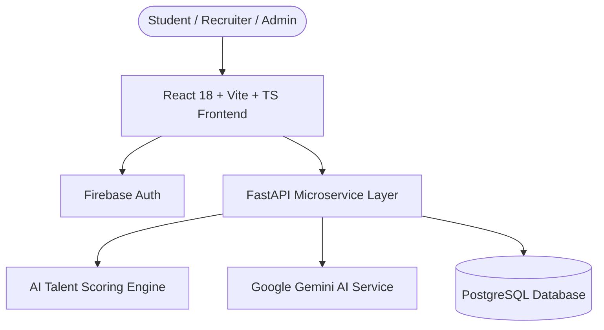

# 🎓 SkillBridge (Portal for Academia - SIH 26044)

> **AI-Powered Academic-Industry Skill Readiness & Talent Acquisition Ecosystem**

SkillBridge is an end-to-end platform bridging academia and industry. Built with a modern **FastAPI + PostgreSQL** microservices backend and a responsive **React 18 + Vite + TypeScript** frontend, it delivers automated ATS resume extraction, AI talent scoring, enterprise hiring workflows, and college skill gap analytics.

---

## ✨ Key Features

### 👨‍🎓 For Students
- **ATS Resume Parsing**: Automated PDF & DOCX resume extraction using Google Gemini AI models.
- **Skill Gap & Benchmark Analysis**: Real-time evaluation against target industry roles (Frontend, Full-Stack, Backend, DevOps, Data Science).
- **Interactive Career Matrix**: Automated skill matrix mapping and ATS-compatible resume generator.

### 🏢 For Enterprises & Recruiters
- **AI Talent Match Scoring**: Algorithmic evaluation matching candidate proficiencies, project output, and academic performance against job requirements.
- **Candidate Evaluation Portal**: Enterprise interview scheduling, live feedback modal, and candidate pipeline tracking.

### 🏛️ For Colleges & Institutions
- **Institutional Skill Analytics**: Department-wise and batch-level skill breakdown and placement readiness metrics.
- **Academic Benchmark Insights**: Actionable data on missing industry skills across student cohorts.

---

## 🛠️ Technology Stack

| Domain | Technology |
| :--- | :--- |
| **Frontend Framework** | React 18, TypeScript, Vite |
| **UI & Styling** | Vanilla CSS, Tailwind CSS, Lucide Icons, Glassmorphism UI |
| **Backend Framework** | FastAPI (Python 3.10+), Uvicorn |
| **Database & ORM** | PostgreSQL, SQLAlchemy |
| **AI & ML Integration** | Google Gemini API (Document & Text Understanding) |
| **Authentication & Auth** | Firebase Authentication |
| **Testing Suite** | Pytest, Async API test suite |

---

## 🏗️ System Architecture



---

## 🚀 Getting Started

### Prerequisites
- **Node.js**: v18.0.0+
- **Python**: v3.10+
- **PostgreSQL**: v14+ (or local SQLite fallback)

### 1. Environment Setup
Copy the environment template and fill in your credentials:
```bash
cp .env.example .env
```

### 2. Backend Setup
```bash
cd backend
python -m venv venv
# On Windows:
.\venv\Scripts\activate
# On macOS/Linux:
source venv/bin/activate

pip install -r requirements.txt
python seed_demo_students.py
uvicorn main:app --reload --port 8000
```

### 3. Frontend Setup
```bash
cd frontend
npm install
npm run dev
```
Open `http://localhost:5173` in your browser.

---

## 🧪 Testing

Run the automated backend test suite:
```bash
cd backend
pytest
```

---

## 📄 License
This project is licensed under the MIT License - see the [LICENSE](LICENSE) file for details.
